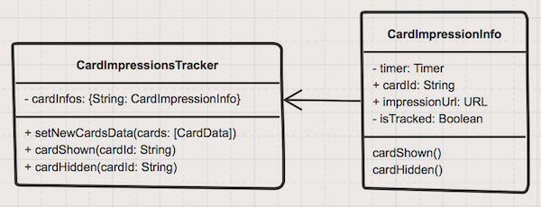

# Zowdow Autosuggest Service

© 2015-2017 Zowdow, Inc.

The Zowdow Autosuggest service is intended to provide application developers with a new opportunity to monetize in the search autosuggest space.

We offer a robust, micro-SDK for iOS that is currently deployed across many distribution partners.

We also offer access through a direct API as documented in the example here.

The application developer will require an app-id key in order to integrated and test. You can request an app-id key by sending an email to dev@zowdow.com.

# Impressions tracking
If you are using this example in your production application, you should take measures to correctly track cards impressions. We are using MRC standard for impressions tracking, introducing following rule: impression should be tracked, if at least 50% card is shown for at least 1 second. Also, timer should not invalidate if card persist between 2 consistent requests. We've created a class to simplify tracking work in you application.

Here is class diagram of impressions tracking classes.

For tracking you should use `CardImpressionsTracker` class.

1. When new data is obtained from API, call `setNewCardsData` method and pass new cards to it
2. Call `cardShown` method for all cards that are at least 50% visible
3. Call `cardHidden` method for all other cards (you can see an example in sample code `RootViewController.swift` method `trackNewItems`)
4. Track all events that can change cards visibility (e.g. view scroll or device orientation change) and call `cardShown` and `cardHidden` methods for cards that changed visibility.

`CardImpressionsTracker` will take care about all other tasks like timer setup, tracking cards persistence between requests and so on.
